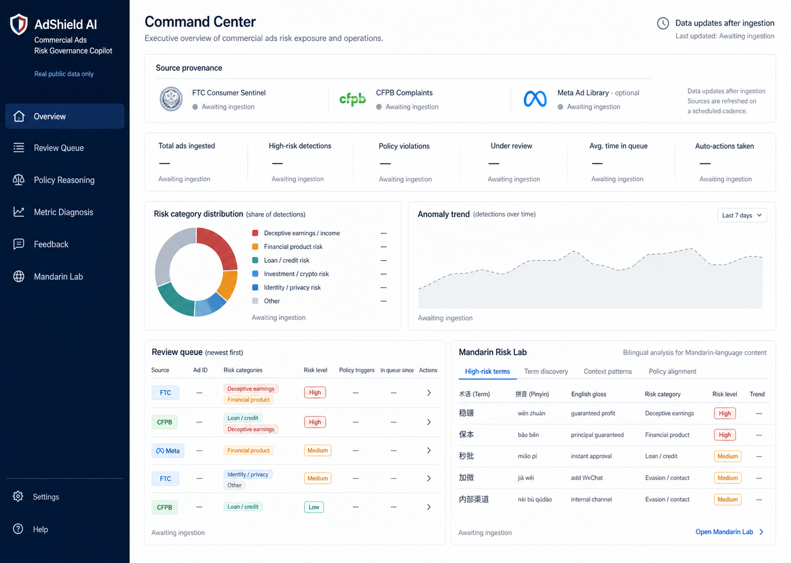

# AdShield AI — Commercial Ads Risk Governance Copilot

AdShield AI is a portfolio-grade risk strategy and operations system built for a TikTok **Risk Strategy & Operations Analyst (Mandarin Speaker)** application. It turns real public consumer-harm data into a bilingual case-triage workflow: ingest, normalize, extract evidence, retrieve policy rules, score risk, route decisions, collect reviewer feedback, and diagnose operating metrics.

> **Truth boundary:** This project has no TikTok internal access and does not claim to reproduce TikTok enforcement decisions. It uses public FTC and CFPB data as risk priors and vocabulary, and optionally uses the official Meta Ad Library API when credentials are supplied. It never substitutes synthetic dashboard data.

## 30-second recruiter walkthrough

| Question | Answer |
|---|---|
| **What problem does it solve?** | Commercial ads risk teams must triage huge volumes of potentially deceptive, scam, health, gambling, and counterfeit ads — across English and Mandarin — without auto-approving harm or burying reviewers. AdShield AI turns raw text into a prioritized, explainable review queue. |
| **Why is the data real?** | It ingests the official **FTC Consumer Sentinel 2024** archive and the **CFPB Consumer Complaint Database** (official API, with a CC0 public-domain mirror fallback), and optionally real **Meta Ad Library** creatives. No dashboard number or example is fabricated; synthetic text exists only in `tests/`. |
| **What does the dashboard show?** | A Command Center (provenance, real record counts, high-risk rate, queue size), a searchable Review Queue + Investigation Desk, source-linked Policy Reasoning, a Metric Diagnosis page (category mix, feature lift, anomalies, **rule-vs-LLM comparison**), human feedback, and a Mandarin Risk Lab. |
| **What does the AI do?** | A transparent, deterministic rule engine extracts bilingual risk evidence, retrieves the most relevant policy rule, and produces a risk score, severity, confidence, and a recommended action — every number traceable. See the [Risk Scoring Methodology](docs/RISK_SCORING_METHODOLOGY.md). |
| **What do humans still decide?** | Anything ambiguous. The engine escalates the mid-band and low-confidence cases to human review and only auto-acts when score *and* confidence are both strong. CFPB complaints are never treated as confirmed ad violations. |
| **How does it map to TikTok's role?** | It mirrors a *Risk Strategy & Operations Analyst (Mandarin)*: policy interpretation, measurable operational routing, bilingual evasion detection, metric diagnosis, and visible integrity/privacy boundaries. See the [Portfolio Summary](docs/PORTFOLIO_SUMMARY.md). |

**Default demo vs. enriched run:** with no API keys the demo runs entirely on public **FTC/CFPB risk cases**. Supplying `META_ACCESS_TOKEN` adds **real ad creative examples** from the official Meta Ad Library; supplying `OPENAI_API_KEY` adds an optional LLM second opinion. Deterministic scoring is always the default. See [Real Ads Enrichment](docs/REAL_ADS_ENRICHMENT.md).



## Why it maps to TikTok Risk Strategy & Operations

- Combines policy interpretation with measurable operational routing.
- Shows human-in-the-loop judgment for ambiguous, market-specific decisions.
- Adds Mandarin evasion signals, pinyin/homophone awareness, and off-platform diversion patterns.
- Diagnoses category mix, feature lift, escalation coverage, anomalies, and review efficiency.
- Keeps source provenance, model limits, privacy, and false-positive risk visible.

## Real public data

| Source | Role | Credential | Current behavior |
|---|---|---:|---|
| [FTC Consumer Sentinel Network Data Book 2024](https://www.ftc.gov/reports/consumer-sentinel-network-data-book-2024) | Aggregate fraud/category/state priors and reported-loss context | None | Official ZIP/CSV archive |
| [CFPB Consumer Complaint Database](https://www.consumerfinance.gov/data-research/consumer-complaints/) | Finance vocabulary, issues, and public scrubbed narratives | None | Official API first; documented CC0 real-data mirror sample only when the official endpoint blocks the current network |
| [Meta Ad Library API](https://www.facebook.com/ads/library/api/) | Real ad creatives for keyword searches | `META_ACCESS_TOKEN` | Optional; skipped honestly when absent |
| [TikTok Advertising Policies](https://ads.tiktok.com/help/article/tiktok-advertising-policies?lang=en) and FTC guidance | Local summarized policy rules | None | Short summaries with source URL and check date |

Raw responses are timestamped under `data/raw/`; normalized Parquet files and the DuckDB mart are written under `data/processed/`. Both are ignored by Git because they can be reproduced and may contain public complaint text.

## Product surfaces

1. **Command Center** — provenance, real record counts, high-risk rate, queue size, review-time estimate, category mix, and anomalies.
2. **Review Queue / Investigation Desk** — original public-source text, extracted evidence, matched rules, score, action, confidence, and reviewer decision.
3. **Policy Reasoning** — source-linked local policy summaries, never large copied passages.
4. **Metric Diagnosis** — feature lift, language comparison, anomaly flags, auto-decision coverage, and AI evaluation.
5. **Human Feedback** — local DuckDB labels; precision/recall/F1 remain blank until labels exist.
6. **Mandarin Risk Lab** — bilingual terms and an explicit empty state when no real Mandarin examples are present.

## Architecture

```text
FTC ZIP + CFPB API/mirror + optional Meta API
                   │
                   ▼
        timestamped raw manifests
                   │
                   ▼
       normalized Parquet datasets
                   │
                   ▼
 evidence → taxonomy → policy retrieval → deterministic score
                   │
                   ▼
        DuckDB analytics + feedback mart
                   │
                   ▼
         FastAPI + React command center
```

## Run locally

Prerequisites: Python 3.11+, Node 20+, `uv`, and `npm`.

```bash
make install
make ingest
make transform
make test
make app
```

Open `http://127.0.0.1:8501`. For separate frontend/backend hot reload, run `make dev` and open `http://127.0.0.1:5173`.

### API keys

Copy `.env.example` to `.env`.

- `META_ACCESS_TOKEN`: enables official Meta Ad Library ingestion. Without it, the run writes a transparent skipped manifest and continues.
- `OPENAI_API_KEY`: enables optional LLM comparison through the Responses API. Without it, deterministic evidence extraction, scoring, policy retrieval, analytics, feedback, and the full dashboard still work.

## DuckDB tables

`ads`, `advertisers`, `ad_risk_scores`, `policy_rules`, `ftc_fraud_categories`, `cfpb_complaints`, `human_review_feedback`, and `ingestion_runs`.

Validation checks enforce non-empty ad text, unique ad IDs, valid taxonomy categories, and source/timestamp presence. See `data/processed/validation_report.json` after transformation.

## AI boundary

The deterministic engine is the reliable default. It extracts regulated products, guarantees/urgency, off-platform contact, Mandarin evasion terms, and category signals. Scores are triage recommendations—not legal conclusions. A high score does not prove wrongdoing, and CFPB complaints are not verified ad violations. The full scoring formula, thresholds, and false-positive/false-negative tradeoff are documented in the [Risk Scoring Methodology](docs/RISK_SCORING_METHODOLOGY.md).

Optional LLM output is a comparison layer, not an automatic enforcement authority. The `GET /api/llm-comparison` endpoint and the Metric Diagnosis page show a 5-case rule-vs-LLM comparison; it only calls the model when `OPENAI_API_KEY` is set and otherwise renders a clean empty state. Human reviewers own ambiguous and market-specific decisions.

## Privacy and responsible use

- CFPB publishes narratives only after its own consent and scrubbing process; this project excludes company and ZIP fields from the dashboard.
- Raw public files stay local and Git-ignored.
- FTC rows are aggregates, not individual complaint records.
- No identity inference, sensitive-trait inference, scraping that bypasses platform terms, or private platform data is used.
- Public complaint volume is not market-share adjusted and should not be read as company misconduct prevalence.

## Data limitations

- FTC Consumer Sentinel reports are unverified and the annual files are aggregate.
- CFPB complaints are not a statistical sample and many records do not include narratives.
- The fallback CFPB mirror is a real 1,000-row public-domain sample, not a complete current database.
- Without Meta credentials, the app has complaint-derived cases rather than real ad creatives and says so.
- Precision/recall/F1 require human feedback labels and remain unavailable before review.

## Screenshots

The selected visual target is included above. To capture the running dashboard, build the mart, start `make app`, and capture `http://127.0.0.1:8501` at 1440×1024. The repository’s `design-qa.md` records the final visual comparison.

## Documentation

| Doc | Purpose |
|---|---|
| [Risk Scoring Methodology](docs/RISK_SCORING_METHODOLOGY.md) | Model card: deterministic design, score components, thresholds, FP/FN tradeoff, why this is not an enforcement model. |
| [Real Ads Enrichment](docs/REAL_ADS_ENRICHMENT.md) | How Meta Ad Library enrichment works, keywords, raw storage, and honest no-token behavior. |
| [Evaluation Report](docs/EVALUATION_REPORT.md) | Current metrics and the rule-vs-LLM comparison sample. |
| [Risk Taxonomy](docs/RISK_TAXONOMY.md) · [Metric Dictionary](docs/METRIC_DICTIONARY.md) | Bilingual categories and per-metric definitions/limitations. |
| [Project Brief](docs/PROJECT_BRIEF.md) · [Portfolio Summary](docs/PORTFOLIO_SUMMARY.md) | Product framing and interview/job-requirement mapping. |

## Resume bullets

- Built AdShield AI, an AI-assisted commercial ads risk governance copilot using real public ad, fraud, and consumer complaint data to detect deceptive claims, financial scams, health/weight-loss risks, and Mandarin-language evasion patterns.
- Designed a bilingual risk taxonomy, evidence extraction workflow, policy reasoning module, human-in-the-loop review queue, and risk scoring engine to support scalable ads governance decisions.
- Developed SQL/Python metric diagnosis dashboards to analyze risk-category distribution, feature lift, escalation coverage, review efficiency, and false-positive/false-negative tradeoffs.

See [the portfolio summary](docs/PORTFOLIO_SUMMARY.md) for an interview narrative and job-requirement mapping.
